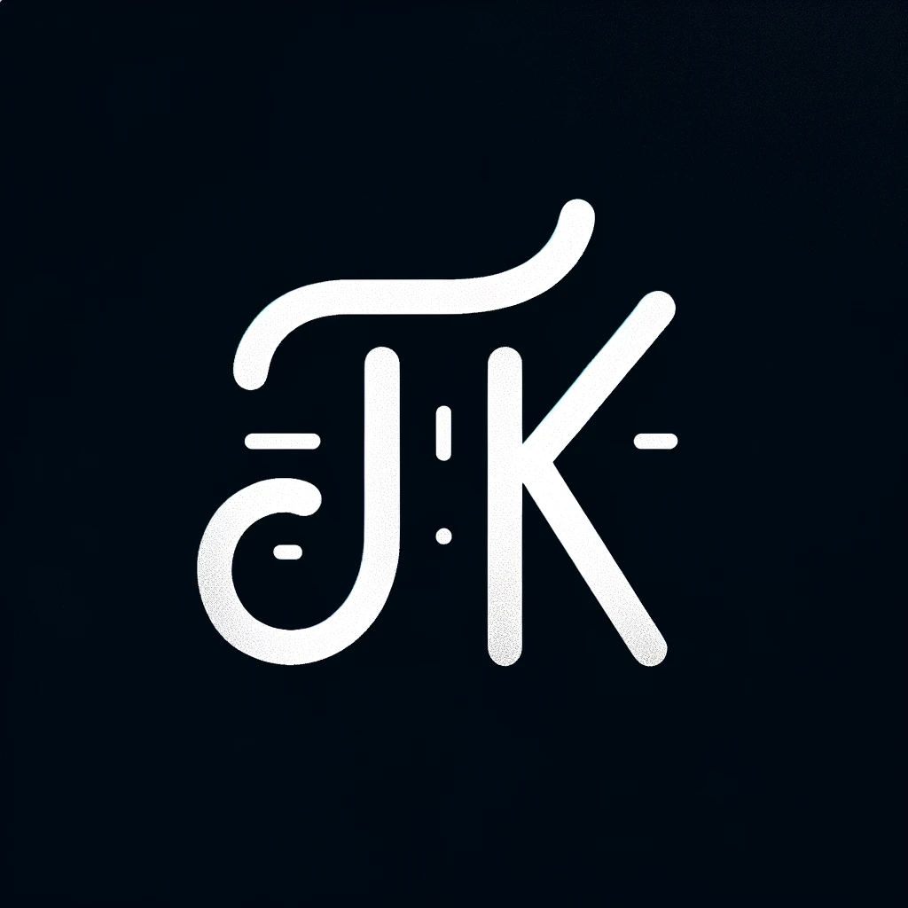

<div align="center">
<a href="https://talhakerpicci.com"></a>
</div>

<div align="center">
<h1>talhakerpicci.com</h1>
<p>My personal portfolio website</p>
</div>

# Tech Stack

- [NextJS][nextjs] - UI framework
- [Vercel][vercel] - Hosting and Deployment
- [TailwindCSS][tailwind] / CSS - Styling and UI
- [PlanetScale][planetscale]: Database Storage for Analytics
- [Next Themes][nexttheme]: Color Theme
- [React Refractor][reactrefractor]: Syntax Highlighting

## Project Overview

| [Site][site]          |
| --------------------- |
| ![Site][site-preview] |

## Run Project Locally

Follow this guide to get this site runnning locally:

### Clone Repository

```js
git clone https://github.com/Evavic44/talhakerpicci.com.git

cd talhakerpicci.com

npm install
```

## Build

```bash
npm run build
```

<!-- Link Refs -->

[nextjs]: https://nextjs.org
[vercel]: https://vercel.com
[tailwind]: https://tailwindcss.com
[nexttheme]: https://github.com/pacocoursey/next-themes
[reactrefractor]: https://github.com/rexxars/react-refractor
[site]: https://talhakerpicci.com
[site-preview]: ./public/site.png
[localhost]: http://localhost:3000
